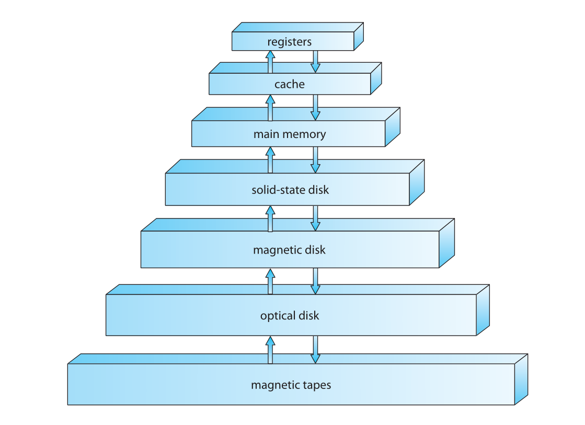

# introduction

* operating system responsible for managing all hardware resources and
* kernel runs everything in a secure area of memory
* system programs are those associated with the operating system but not kernel
* middleware is some set of frameworks providing additional services

## os organization

* to start running, computer runs an initial bootstrap program
* bootstrap program reads **firmware** from ROM or EEPROM
* needs to know how to load the OS & start executing it
* once the kernel starts executing it spawns services or **system daemons**

!!! note
    The first system process on *NIX based machines is `init`.

* the hardware can also trigger events via an **interrupt**
* software may trigger hardware interrupts via a **system / monitor call**
* interrupt arch. must save the address of the interrupted instruction
    * old designs stored interrupt addr. in a fixed location
    * more recent architecture store return addr. on the system stack
* storage
    * most memory is stored in RAM (Random Access Memory)
    * main memroy stored in DRAM on chip
    * main memory is too small to store all needed programs & data
    * main memory is volatile storage that loses contents without power

## os operations

* operating systems are **interrupt driven**
* events (which in turn may run software) are nearly always signaled by interrupt or trap
* trap is software-generated interrupt
* **for each type of interrupt, kernel decides what action to take**
* vital that errors in one process do not affect other processes
* dual mode / multimode
    * most os have a kernel mode and user mode (distinguished by mode bit)
    * provides us a way to protect os from bad users & protect users from each other
    * **privileged instructions** are those instructions that could cause harm (only get executed in kernel)
    * can also do multimode and have special modes for dedicated processes, such as virtualization software
    * intel64 has 4 privilege levels but no mode for virtualization
* timer: need to make sure OS gets control back sometimes
    * every so often the OS will regain control and decide what to do w/ the system
    * prevents programs from just taking over all cycles
    *
