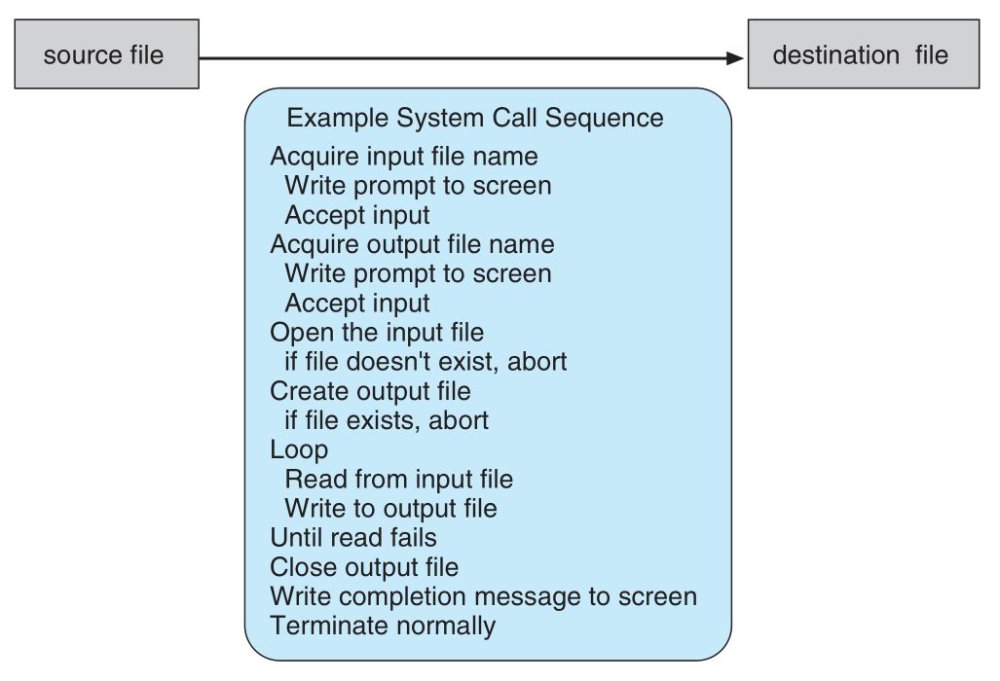

# Operating-System Structures

## services

* user interface: processes that enable the user to provide instructions 
* program execution: load and execute arbitrary program
* I/O operations: provide programs access to I/O devices
* filesystem manipulation: CRUD file mechanics
* communications:
    * between processes via shared memory
    * between processes via message passing
* error detection: handle all failures
    * I/O failure (parity error, communication failure)
    * access to illegal memory location
    * hardware error
* resource allocation: schedule tasks and handle switching of contexts
* accounting: keeping track of usage patterns / user statistics
* protection and security:
    * user authentication, passwords / etc...
    * file permissioning schemes

## system calls

* provide a user-facing interface to services made available by an OS
* usually written in C / C++

Example: A program to read data from one file and copy it to another.

* first, the filenames of the two files need to be obtained
    * could be provided as arguments to a command line call
    * could be taken from a graphical user interface
    * many I/O system calls needed to get these filenames
* then, we open input file and create output file
    * I/O system call to access filesystem
    * must handle error cases:
        * input file may not exist
        * user may not have permissions to access input file
* then, loop and read from input / write to output
    * I/O system call while reading / writing data
    * could have hardware failure preventing either of these operations
* then, close both files
    * more system calls
* return some output to the user
* note that most programmers operate at a higher level API




!!! note Example of Standard API
    
    This is an example of a common API, taken from the `read()` function 
    available on UNIX & Linux operating systems.  The API is found via
    the `man` page for `read`:

    ```c
    #include <unistd.h>

    ssize_t read(int fd, void *buf, size_t count)
    ```

    Any program using this method must `#include` the `unistd.h` header, as
    this file defines the data types used.

## types of system calls

* process control
* file manipulation
* device manipulation
* information maintenance
* communications
* protection
